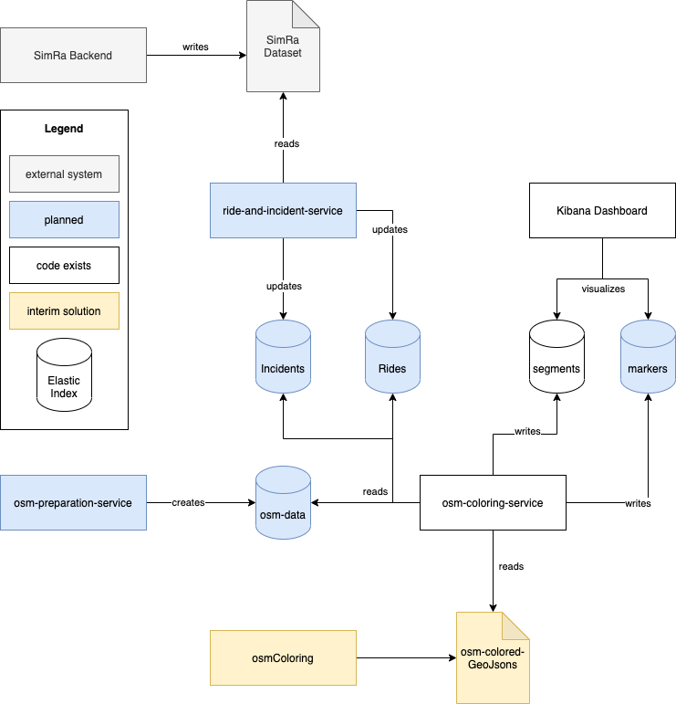
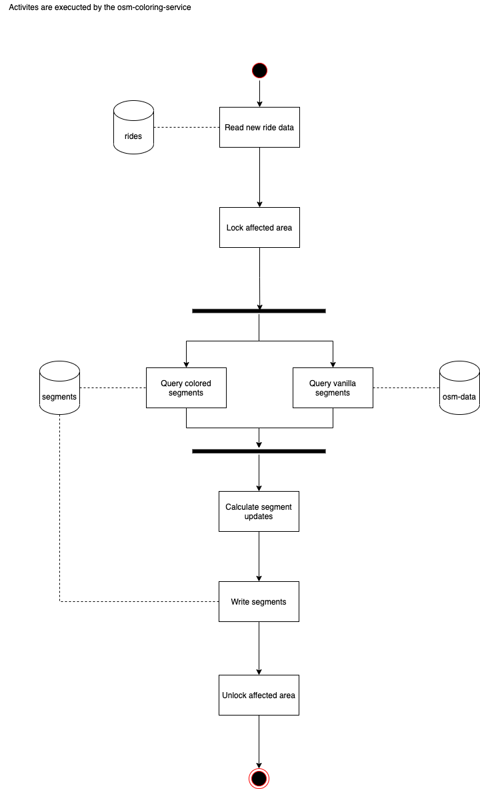

# SimRa Services

This is a meta-repository for the SimRa Services project.
The goal of this project is to create a service based solution that relies on Elasticsearch and Kibana to create a realitme visualization of the SimRa dataset.
Before doing anyhting else, one has to initialize all submodules: `git submodule update --init`.

## High Level Architecture

In the moment, only code for a single service (osm-coloring-service) exists.
Thus, as an interim solution, the service reads the GeoJson files created by the [osmColoring](https://github.com/simra-project/osmColoring) project rather than querying raw data from elastic.

In the end, the process of updating segments when a new ride is detected should look like so:

Updating markers could be done in a similar fashion.
